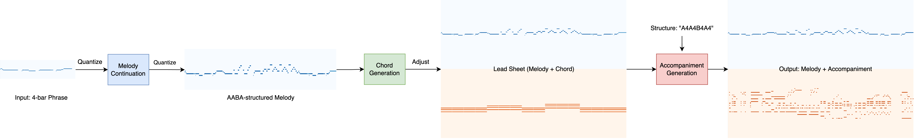

# XGeneration
## The AI Composition Package for Humming Tacos

Only for model inference. The training and preprocessing scripts are removed. 

The XGeneration pipeline is as follows:

### 

### Task1: Melody Continuation

Given a 4-bar phrase, generate AABA-structured melody.

Download the pretrained model [here](https://drive.google.com/file/d/1rKqBCrkfhDTt0B1nw7mDndJ7RpMNKAk5/view?usp=sharing).

### Task2: Chord Generation

Generate simple chord for the melody from task1, output lead sheet (melody + chord).

### Task3: Accompaniment Generation

Generate Chinese pop style piano accompaniment based on given lead sheet.

Download the pretrained model [here](https://drive.google.com/file/d/1HUkbbk9qkvDocYWmdK5Zq6vUkcKympGW/view?usp=sharing).

### References:

```tex
@inproceedings{music-sketchnet,
         author = {Ke Chen and Cheng-i Wang and Taylor Berg-Kirkpatrick and Shlomo Dubnov},
         title = {Music SketchNet: Controllable Music Generation via Factorized Representations of Pitch and Rhythm},
         booktitle = {Proceedings of the 21th International Society for Music Information Retrieval Conference, {ISMIR}},
         year = {2020}
}
```

```
@article{lim2017chord,
  title={Chord generation from symbolic melody using BLSTM networks},
  author={Lim, Hyungui and Rhyu, Seungyeon and Lee, Kyogu},
  journal={arXiv preprint arXiv:1712.01011},
  year={2017}
}
```

```tex
@inproceedings{zhao2021accomontage,
  author    = {Jingwei Zhao and Gus Xia},
  title     = {AccoMontage: Accompaniment Arrangement via Phrase Selection and Style Transfer},
  booktitle = {Proceedings of the 22nd International Society for Music Information Retrieval Conference, {ISMIR} 2021, Online, November 7-12, 2021},
  pages     = {833--840},
  year      = {2021},
  url       = {https://archives.ismir.net/ismir2021/paper/000104.pdf}
}
```

